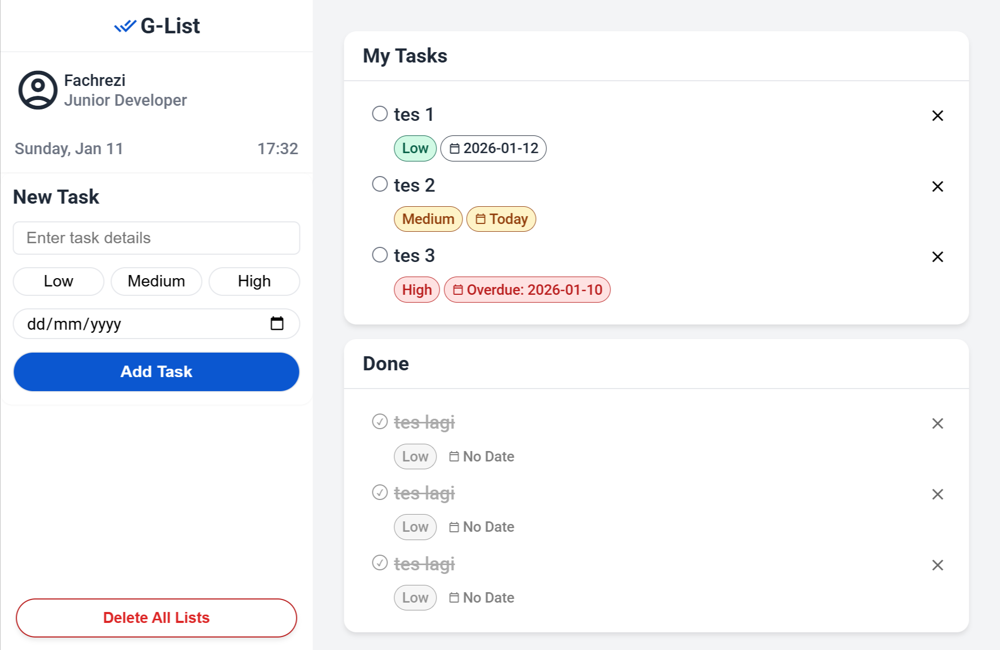

# G-List - Personal Task Manager

G-List is a clean, responsive, and efficient Todo List application built with **Vanilla JavaScript**. It is designed to help users manage their daily tasks with priority levels and deadline tracking.

The application features a modern UI inspired by Material Design and utilizes user's local storage to persist data, ensuring tasks remain saved even after refreshing the browser.

## 🚀 Key Features

- **Smart Task Management:** Add tasks with specific details (Title, Priority, Due Date).
- **Priority Levels:** Organize tasks by urgency:
  - 🟢 **Low**
  - 🟡 **Medium**
  - 🔴 **High**
- **Dynamic Date Logic:**
  - Tasks due **Today** are highlighted.
  - **Overdue** tasks are visually marked in red text.
  - **Future** tasks are displayed cleanly.
- **Internal Scrolling Dashboard:** A desktop-optimized layout where the sidebar and main content areas scroll independently, keeping the UI stable.
- **Persistent Data:** Uses `LocalStorage` to save tasks, user name, and position.
- **Real-time Clock:** Displays the current date and time dynamically.
- **Responsive Design:** Fully optimized for both mobile devices and desktop screens.

## 🛠️ Technologies Used

- **HTML5:** Semantic structure.
- **CSS3:** Custom properties (variables), Flexbox, CSS Grid, and Media Queries for responsiveness.
- **JavaScript (ES6+):** DOM Manipulation, Event Handling, LocalStorage API, and Date Logic.

## 📂 Project Structure

```text
G-List/
├── index.html      # Main HTML structure
├── style.css       # Styling and layout logic
├── index.js        # Application logic (DOM, State, Events)
└── README.md       # Project documentation
```

## 📦 How to Use

1.  **Open the Project:**
    Simply open the `index.html` file in your preferred web browser (Chrome, Edge, Firefox, etc.).

2.  **Personalize:**
    On the very first load, the app will prompt you to enter your **Name** and **Position**. This data is stored locally to personalize your dashboard header.

3.  **Add a New Task:**

    - Type your task detail in the input field.
    - Select a priority level: **Low**, **Medium**, or **High**.
    - (Optional) Pick a due date.
    - Click the **"Add Task"** button.

4.  **Manage Tasks:**
    - **Mark as Done:** Click the circle checkbox next to a task. It will move to the "Done" section below.
    - **Delete Task:** Click the **X** icon on the right side of any task to remove it permanently.
    - **Delete All:** Use the "Delete All Lists" button to clear all data and start fresh.

## 📸 Screenshots

### Desktop View



### Mobile View


## 👨‍💻 Author

**Fachrezi Barus**

- **Role:** Physics Student & Aspiring Web Developer
- **Focus:** Front-End Development (HTML, CSS, JS)

---

_Created as a Mission 4 for Harisenin Bootcamp Project ._
